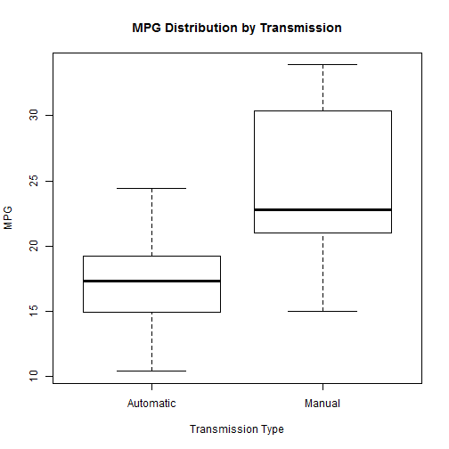
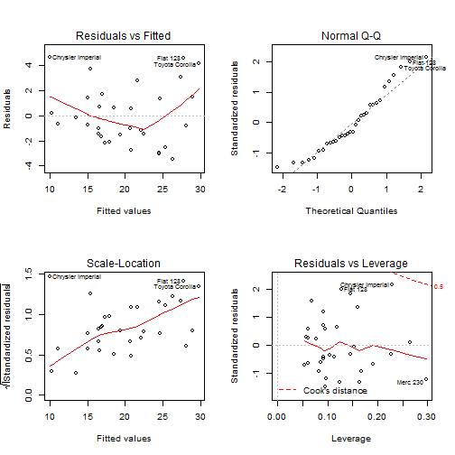

---

---
#Automatic vs Manual MPG Regression Models

##Executive Summary

I am working for Motor Trend, a magazine about the auto industry. This paper will examine the relationship between a set of variables and miles per gallon (MPG) found in the mtcars data set provided by R. In particular I am looking at the questions 

-Is automatic or manual transmission better for MPG
-Quantify this difference

##Preliminary Investigation and Exploratory Analysis

First I'll load the data into R. Then I'll print the variables in the data set so we can see what we're working with. 


```r
data(mtcars)
names(mtcars)
```

```
##  [1] "mpg"  "cyl"  "disp" "hp"   "drat" "wt"   "qsec" "vs"   "am"   "gear"
## [11] "carb"
```

The "am" column is the transimission (0 = automatic, 1 = manual). I want to use that to predict mpg. I'll turn "am" into a factor (and label it appropriately) and make a boxplot to get a sense of the data


```r
mtcars$am <- as.factor(mtcars$am)
levels(mtcars$am) <- c("Automatic", "Manual")
boxplot(mpg ~ am, data = mtcars, xlab = "Transmission Type", ylab = "MPG", main = "MPG Distribution by Transmission")
```

 

That's interesting. So it seems at a glance that manual transimissions tend to have better mileage than automatic. 

##Basic Linear Model

Since we're interested in transmissions, I'll fit a linear model based purely on the transimission. 

```r
fit <- lm(mpg ~ am, data = mtcars)
summary(fit)
```

```
## 
## Call:
## lm(formula = mpg ~ am, data = mtcars)
## 
## Residuals:
##    Min     1Q Median     3Q    Max 
## -9.392 -3.092 -0.297  3.244  9.508 
## 
## Coefficients:
##             Estimate Std. Error t value Pr(>|t|)    
## (Intercept)    17.15       1.12   15.25  1.1e-15 ***
## amManual        7.24       1.76    4.11  0.00029 ***
## ---
## Signif. codes:  0 '***' 0.001 '**' 0.01 '*' 0.05 '.' 0.1 ' ' 1
## 
## Residual standard error: 4.9 on 30 degrees of freedom
## Multiple R-squared:  0.36,	Adjusted R-squared:  0.338 
## F-statistic: 16.9 on 1 and 30 DF,  p-value: 0.000285
```

R has automatically picked "Automatic" transimission cars as the baseline, so the Intercept of 17.147 is actually the average mpg for automatic cars. The coefficient for the "Manual" transmission is interepreted as "how many more miles per gallon on average do you get by switching from an Automatic to a Manual" which is 7.245. This is consistent with our earlier findindgs, it seems that "Manual" transmission cars on average get 7.245 MORE miles to the gallon than automatic cars do. However, note the Adjusted R-Squared is only 0.3385, which is quite low. This means this model does not fit the data terribly well. 

##Finding Improved Linear Model

Now let's find a better fit for our model. I'm going to update the original fit model with each variable in the mtcars set one at a time, building more complex models. I will then examine the Pr(>F) value and if it is statistically significant (less than 0.05) this means that adding the additional variable provides a better "significantly" better fit to the data.


```r
fit2 <- update(fit, mpg ~am + wt)
fit3 <- update(fit, mpg ~am + wt + qsec)
fit4 <- update(fit, mpg ~ am + wt + qsec + cyl)
fit5 <- update(fit, mpg ~ am + wt + qsec + cyl + disp)
fit6 <- update(fit, mpg ~ am + wt + qsec + cyl + disp + hp)
fit7 <- update(fit, mpg ~ am + wt + qsec + cyl + disp + hp + drat)
fit8 <- update(fit, mpg ~ am + wt + qsec + cyl + disp + hp + drat + vs)
fit9 <- update(fit, mpg ~ am + wt + qsec + cyl + disp + hp + drat + vs + gear)
fit10 <- update(fit, mpg ~ am + wt + qsec + cyl + disp + hp + drat + vs + gear + carb)
anova(fit, fit2, fit3, fit4, fit5, fit6, fit7, fit8, fit9, fit10)
```

```
## Analysis of Variance Table
## 
## Model  1: mpg ~ am
## Model  2: mpg ~ am + wt
## Model  3: mpg ~ am + wt + qsec
## Model  4: mpg ~ am + wt + qsec + cyl
## Model  5: mpg ~ am + wt + qsec + cyl + disp
## Model  6: mpg ~ am + wt + qsec + cyl + disp + hp
## Model  7: mpg ~ am + wt + qsec + cyl + disp + hp + drat
## Model  8: mpg ~ am + wt + qsec + cyl + disp + hp + drat + vs
## Model  9: mpg ~ am + wt + qsec + cyl + disp + hp + drat + vs + gear
## Model 10: mpg ~ am + wt + qsec + cyl + disp + hp + drat + vs + gear + carb
##    Res.Df RSS Df Sum of Sq     F  Pr(>F)    
## 1      30 721                               
## 2      29 278  1       443 63.01 9.3e-08 ***
## 3      28 169  1       109 15.52 0.00075 ***
## 4      27 168  1         2  0.21 0.64862    
## 5      26 161  1         6  0.91 0.35172    
## 6      25 151  1        10  1.48 0.23666    
## 7      24 149  1         2  0.27 0.60831    
## 8      23 149  1         0  0.03 0.86214    
## 9      22 148  1         1  0.14 0.71365    
## 10     21 147  1         0  0.06 0.81218    
## ---
## Signif. codes:  0 '***' 0.001 '**' 0.01 '*' 0.05 '.' 0.1 ' ' 1
```

It is clear that the fit3 model, mpg being predicted by am, wt, and qsec gives us the strongest evidence to reject the null hypothesis. 


```r
summary(fit3)
```

```
## 
## Call:
## lm(formula = mpg ~ am + wt + qsec, data = mtcars)
## 
## Residuals:
##    Min     1Q Median     3Q    Max 
## -3.481 -1.556 -0.726  1.411  4.661 
## 
## Coefficients:
##             Estimate Std. Error t value Pr(>|t|)    
## (Intercept)    9.618      6.960    1.38  0.17792    
## amManual       2.936      1.411    2.08  0.04672 *  
## wt            -3.917      0.711   -5.51    7e-06 ***
## qsec           1.226      0.289    4.25  0.00022 ***
## ---
## Signif. codes:  0 '***' 0.001 '**' 0.01 '*' 0.05 '.' 0.1 ' ' 1
## 
## Residual standard error: 2.46 on 28 degrees of freedom
## Multiple R-squared:  0.85,	Adjusted R-squared:  0.834 
## F-statistic: 52.7 on 3 and 28 DF,  p-value: 1.21e-11
```

It is also clear our adjusted R squared value is now 0.8336, meaning we have explained 83% of the variance (and included a penalty for adding more variables) in our model, which is a significantly better fit than our original model. Also note the coefficients have very p-values less than 0.05 meaning they are statistically significant (although the Intercept does not). 

Note also this can be verified using the step() function which uses a stepwise algorithm to find the "best" model and finds the same model using am, wt, and qsec as the independent variables.

Now I'll plot the residuals of this fit3 model that I've found to see if it seems reasonable. 


```r
par(mfrow = c(2,2))
plot(fit3)
```

 

There does not seem to be a pattern in the residual plot, meaning we have avoided heteroskedasticity (non-constant variance). Thus fit3 seems to be a good overall model for explaining mileage

##Conclusions

I have attempted to build a regression model to explain how transmission type influences miles per gallon. After building a model, I have concluded that wt and qsec (weight and essentially acceleration) are also significant and should be included. Based on the summary of the model, I can say that Manual cars generally will get 2.93 more miles per gallon than Automatic, all other things being equal. In conclusion, Manual cars are probably slightly better for mileage than Automatic, although other variables also have significant impact. 

##Further Investigation and Notes

It would be interesting to see how this compares model performs on a training set. Mtcars only contains 32 observations, making this a very small sample. This data also comes from the 1974 issue of Motor Trend, which is not quite up to date with modern models. 
